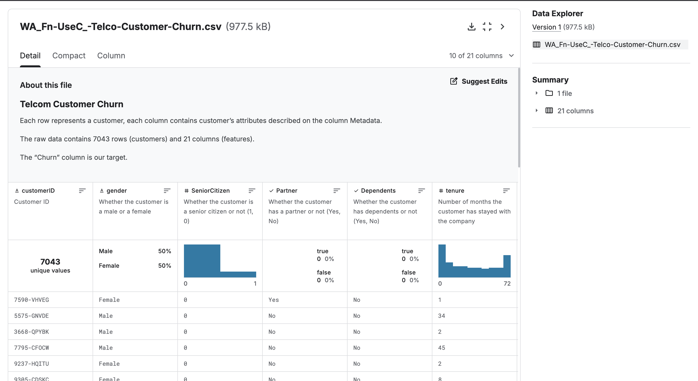

<!-- PROJECT SHIELD BADGES -->


<!-- PROJECT TITLE -->
<h1 align="center">📉 Customer Churn Prediction | Telco Dataset</h1>

<p align="center">
  <b>Predicting customer churn using machine learning.</b><br>
  <i>Logistic Regression | Data Preprocessing | EDA | Model Evaluation | Visualizations</i>
</p>

---

## 🔥 Key Features

- 📊 Exploratory Data Analysis (EDA) with interactive plots  
- 🧹 Advanced data cleaning and preprocessing (handling missing values, encoding, scaling)  
- 🤖 Logistic Regression for churn classification  
- 🎯 Model evaluation (Accuracy, Precision, Recall, F1-score, ROC-AUC, Confusion Matrix)  
- 📈 Feature correlation & importance analysis  
- 📂 Jupyter notebook with step-by-step explanations  

---

## ✨ Dataset

<p align="center">
  
</p>

---
## 🚀 Quick Start

```bash
# 1️⃣ Clone the repository
git clone https://github.com/avijit004/APR_Ass01_2511AI33_IITP
cd APR_Ass01_2511AI33_IITP

# 2️⃣ Install dependencies
pip install -r requirements.txt

# 3️⃣ Launch Jupyter Notebook
jupyter notebook main.ipynb
```


🧰 Project Structure
APR_Ass01_2511AI33_IITP/
├── customer-churn-prediction.ipynb               # Jupyter notebook with code & analysis

├── WA_Fn-UseC_-Telco-Customer-Churn.csv   # Dataset

├── requirements.txt            # Dependencies

├── screenshots/                # Output screenshots

└── README.md                   # Project README


📇 Dataset
Source: Kaggle: Telco Customer Churn
Rows: 7,043
Features: Demographics, account info, service usage, and Churn (target variable)


⚡ Workflow
1.Load dataset & libraries
2.Explore and visualize churn patterns (gender, contract type, payment methods, etc.)
3.Handle missing values (e.g., TotalCharges) and outliers
4.Encode categorical variables, scale numeric features
5.Train & test split for model building
6.Logistic Regression model training
7.Evaluate performance with multiple metrics
8.Visualize confusion matrix & ROC curve


📊 Results
| Metric    | Value |
| --------- | ----- |
| Accuracy  | 0.81  |
| Precision | 0.72  |
| Recall    | 0.65  |
| F1-Score  | 0.68  |


✔️ Insights:
~26.6% of customers churned.
Customers with Month-to-Month contracts & Electronic Check payments churned the most.
Customers without partners/dependents or without online security/tech support showed higher churn.
High monthly charges correlated with higher churn probability.

🛠️ Requirements
Python 3
pandas, numpy, matplotlib, seaborn, scikit-learn
plotly, missingno

Install all dependencies with:
pip install -r requirements.txt


🎓 References

scikit-learn: Logistic Regression

Kaggle: Telco Customer Churn Dataset

🙏 Acknowledgements

-Dr. Chandranath Adak, Assistant Professor, Indian Institute of Technology (IIT) Patna

-Dataset by Ahmed Gaitani

-Inspired by IBM sample datasets and open-source churn prediction work
